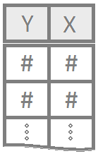

 

----

<!-- Add your customizations in the area below: -->

**1 Quantitative Variable**

**Test Statisitics:** $t, t_d, W$

**Tests:** one sample t-Test, paired sample t-Test, Wilcoxon test Signed-Rank, Permutation

**Graphs:** histogram, boxplot, dot plots

<!------------------------------------------------>

----

<!-- Add your customizations in the area below: -->

**1 Quantitative Variable | 2 Groups**

1 variable of two different groups, such as weight of men vs. women 

**Test Statisitics:** $t, W$

**Tests:** independent samples t-Test, Wilcoxon test Rank Sum, Permutation

**Graphs:** histogram, boxplot

Notes Are these two things different? 

<!------------------------------------------------>

----

<!-- Add your customizations in the area below: -->

**1 Quantitative Variable | 3+ Groups**

**Test Statisitics:** $F$, $H$

**Tests:** ANOVA, Kruskal-Wallis, Permutation

**Graphs:** histogram, boxplot

Notes: Are these groups different? 

<!------------------------------------------------>

----

<!-- Add your customizations in the area below: -->

**2 Quantitative Variables**

**Test Statisitics:** $F$, $t$

**Tests:** Linear Regression, Permutation

**Graph:** Dotplot 

Notes: What happens to Y as X increases? 

<!------------------------------------------------>

----

<!-- Add your customizations in the area below: -->

**1 Quantitative Response | Multiple Explanatory Variables**

**Test Statisitics:** $F$, $t$

**Tests:** Mulitple Linear Regression, Permutation

**Graphs:** Dotplot

<!------------------------------------------------>

----

<!-- Add your customizations in the area below: -->

**Binomial Response | 1 Explanatory Variable**

**Tests statistics:** $Z$

**Tests:** Logistic Regression, Permutation

**Graphs:** Dotplot with logistic curve

Notes: Answers the question: Given X, what is the probability of Y? 

<!------------------------------------------------>

----

<!-- Add your customizations in the area below: -->

**Binomial Response | Multiple Explanatory Variables**

**Tests statistics:** $Z$

**Tests:** Multiple Logistic Regression, Permutation 

**Graphs:** Dotplot with Logistic curve

<!------------------------------------------------>

----

<!-- Add your customizations in the area below: -->

**2 Qualitative Variables**

**Tests statistics:** $F$

**Tests:** Chi-Squared Test, Permutation

**Graphs:** barplot

Notes: The format will be in a table. Where each row is a count and not a specific subject.

<!------------------------------------------------>

----

<footer></footer>

